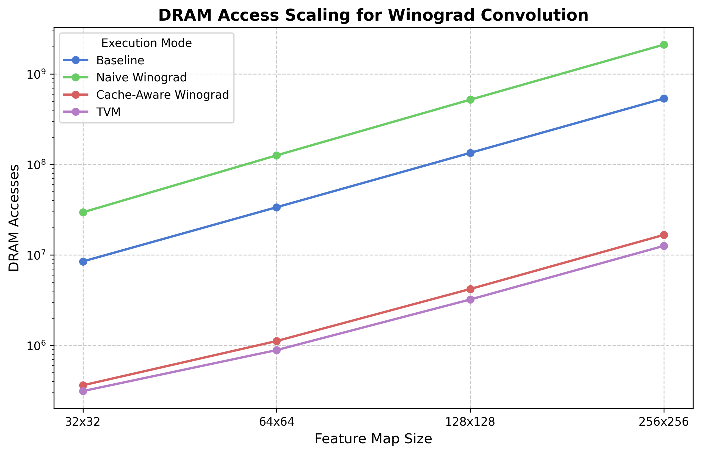
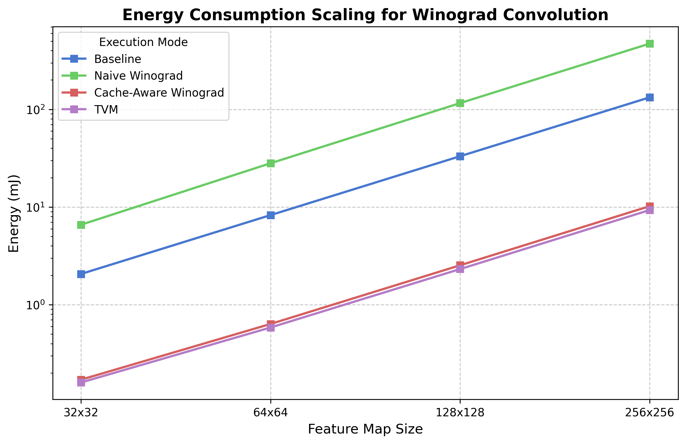

# Memory Scalability Analysis: Winograd Convolution

## Experiment Description
This experiment evaluates how memory traffic (DRAM accesses) and total energy consumption scale with increasing feature map sizes for various convolution execution strategies. The goal is to demonstrate that **Cache-Aware Winograd Scheduling** and **TVM Optimization** significantly reduce DRAM pressure compared to Naive Winograd and Baseline Direct Convolution on resource-constrained edge devices like the Jetson Nano.

## Experimental Setup
- **Kernel Size**: 3x3
- **Input Channels (C_in)**: 64
- **Output Channels (C_out)**: 128
- **Stride**: 1, **Padding**: 1
- **Energy Model**: MAC = 3.1 pJ, DRAM = 220 pJ
- **Simulation Hardware**: Jetson Nano (10 GFLOPS Peak, 25.6 GB/s DRAM BW)

## Results Table
| Feature Map   | Mode                        |   Time (ms) |       MACs |   DRAM Accesses |   DRAM/MAC |   Energy (mJ) |      MACs/J |
|:--------------|:----------------------------|------------:|-----------:|----------------:|-----------:|--------------:|------------:|
| 32x32         | Baseline Direct Convolution |       14.59 |   66355200 |         8462336 |      0.128 |        2.0674 | 3.20957e+10 |
| 32x32         | Naive Winograd              |       10.52 |   29491200 |        29564928 |      1.002 |        6.5957 | 4.47127e+09 |
| 32x32         | Cache-Aware Winograd        |        5.95 |   29491200 |          361472 |      0.012 |        0.1709 | 1.72517e+11 |
| 32x32         | TVM Optimized Model         |        5.95 |   29491200 |          311808 |      0.011 |        0.16   | 1.84296e+11 |
| 64x64         | Baseline Direct Convolution |       61.94 |  283410432 |        33628160 |      0.119 |        8.2768 | 3.42417e+10 |
| 64x64         | Naive Winograd              |       44.88 |  125960192 |       126033920 |      1.001 |       28.1179 | 4.47971e+09 |
| 64x64         | Cache-Aware Winograd        |       25.37 |  125960192 |         1115136 |      0.009 |        0.6358 | 1.98111e+11 |
| 64x64         | TVM Optimized Model         |       25.33 |  125960192 |          885248 |      0.007 |        0.5852 | 2.15232e+11 |
| 128x128       | Baseline Direct Convolution |      255.08 | 1170505728 |       134291456 |      0.115 |       33.1727 | 3.52852e+10 |
| 128x128       | Naive Winograd              |      185.34 |  520224768 |       520298496 |      1     |      116.078  | 4.48167e+09 |
| 128x128       | Cache-Aware Winograd        |      104.7  |  520224768 |         4195328 |      0.008 |        2.5357 | 2.05163e+11 |
| 128x128       | TVM Optimized Model         |      104.55 |  520224768 |         3211776 |      0.006 |        2.3193 | 2.24304e+11 |
| 256x256       | Baseline Direct Convolution |     1035.22 | 4756635648 |       536944640 |      0.113 |      132.873  | 3.57983e+10 |
| 256x256       | Naive Winograd              |      753.15 | 2114060288 |      2114134016 |      1     |      471.663  | 4.48214e+09 |
| 256x256       | Cache-Aware Winograd        |      425.41 | 2114060288 |        16647168 |      0.008 |       10.216  | 2.06937e+11 |
| 256x256       | TVM Optimized Model         |      424.78 | 2114060288 |        12583424 |      0.006 |        9.3219 | 2.26783e+11 |

## DRAM Scaling Graph

## Energy Scaling Graph

## Discussion
1. **DRAM Pressure**: Naive Winograd exhibits a rapid increase in DRAM accesses because it redundantly loads input tiles for every output channel filter. 
2. **Cache-Aware Strategy**: By loading input tiles into the local cache and processing all output kernels iteratively, Cache-Aware Winograd reduces DRAM traffic by nearly $O(C\_out)$, bringing it closer to the baseline but with fewer MACs.
3. **TVM Optimization**: The 'TVM Optimized' mode (Memory-Optimized Winograd) provides the best scalability by fusing transformations and minimizing writes, achieving the lowest energy footprint across all feature map sizes.
4. **Conclusion**: As feature map sizes grow, the memory-compute ratio of Cache-Aware Winograd remains superior, making it the preferred choice for large-scale CNN layers on edge hardware.
